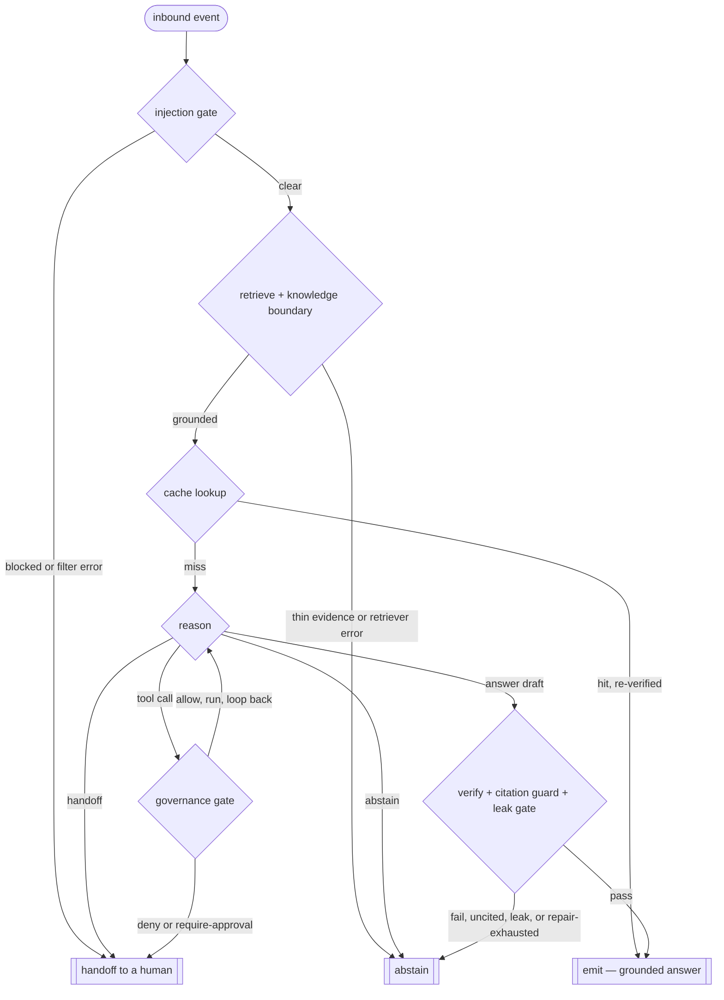

# TENET — Verification-First AI Agent Framework

**Open-source TypeScript agent framework where hallucination defense, source-grounding, capability-token tool sandboxing, and platform rate-limit scheduling are first-class layers — not bolt-ons. One config powers Telegram, Discord, Slack, MS Teams, embedded web widget, REST + gRPC, and ticketing webhooks (Zendesk · Intercom · Freshdesk · ServiceNow). Every BENCHMARKS row is gated in hermetic CI.**

[](https://github.com/zakky8/TENET/actions/workflows/ci.yml)
[](LICENSE)
[](.nvmrc)
[](tsconfig.base.json)
[](packages)
[](docs/BENCHMARKS.md)
[](tsconfig.base.json)
[](CODE_OF_CONDUCT.md)

> **Status:** **1278 tests across 96 suites, all green** (63 workspace packages). Every BENCHMARKS dimension measured in hermetic CI via `pnpm benchmarks`; real-model numbers come from the local `apps/measure-real` runner (the CI gate runs a deterministic stub — see BENCHMARKS.md for the split). 9 surfaces (Discord, Slack, Telegram, Teams, web widget, REST, gRPC, Matrix, voice/Twilio) + 4 ticketing connectors (Zendesk, Intercom, Freshdesk, ServiceNow). 6 model adapters — Anthropic-direct, OpenAI, Gemini, Mistral, Ollama, Bedrock — all streaming, all on ONE canonical `ChatModel` contract (messages-array + required `AbortSignal` + tool round-trips; `@tenet/core/model.ts`). 2 vector stores + Redis/Postgres state stores. Protocol interop: MCP client + OAuth gateway, **A2A v1 (server + client)**, **AG-UI**, ACP. **Step-level durable execution with interrupt() HITL** (`@tenet/durable`), agent harness (compaction + todos + subagents), WASM sandbox + wasmtime, on-prem Helm. Plus **pre-tool-call governance + approval gates + structured audit trail** (`@tenet/governance`). The end-to-end orchestrator (`@tenet/agent`) is **shipped**: `runAgent` drives the fail-closed turn as a `@tenet/workflow` graph — injection gate → retrieve + knowledge-boundary → cache re-verify → decides-and-drafts Reasoner → governance-gated tools → fail-closed verify → single emit edge, with abstain/handoff carried as values and a top-level catch that fails closed on any error. Pre-1.0; APIs may change.

---

## The honest read

This is a *framework*, not a model. It does not train, fine-tune, or distill a frontier LLM. Nothing here "beats" Claude / GPT / Gemini at language tasks — it *calls* them. The defensible claim is a **systems** one: **TENET makes whichever frontier model you call answer only with a source-grounded, verified citation or abstain, and adds pre-tool-call governance — per-tool policy + approval gates + a structured audit trail — as a first-class, in-code layer.** Those are contracts you can read in the packages and exercise in the tests; the hermetic BENCHMARKS gate runs every PR, and numbers are produced, not asserted.

## Where TENET focuses

The differentiator is pre-tool-call governance. `@tenet/governance` ships three things together: per-tool policy rules with deny/allow/require_approval, an idempotent approval gate with cache, and an AuditSink emitting policy.allow / policy.deny / policy.require_approval / approval.decision / tool.invoked / override events.

The capabilities below ship as **first-class layers in TENET** — built in, not bolted on, each backed by a package in this repo. We deliberately do **not** publish a per-competitor ✓/✗ grid: this is an anti-hallucination framework, and asserting specific, unverified capabilities about other named projects is exactly the kind of unsourced claim it exists to prevent. Compare against your own shortlist and their current docs.

| Capability | Ships in TENET |
|---|---|
| Pre-tool-call policy (deny / allow / require-approval) | ✅ `@tenet/governance` |
| Approval gates (HITL) + idempotent approval cache | ✅ `@tenet/governance` |
| Structured audit trail | ✅ `@tenet/governance` |
| Durable execution (step-level replay + `interrupt()` HITL) | ✅ `@tenet/durable` |
| A2A protocol v1 (server + client) | ✅ `@tenet/a2a` |
| AG-UI streaming frontend protocol | ✅ `@tenet/ag-ui` |
| Agent harness (compaction · todos · subagents) | ✅ `@tenet/harness` |
| Atomic-claim multi-judge verifier | ✅ `@tenet/verifier` |
| Deterministic claim pre-checks (numeric · URL fabrication · quote grounding) | ✅ `@tenet/verifier` |
| Claim repair loop + best-of-N verifier-ranked | ✅ `@tenet/refine` |
| Independent hallucination judge (HHEM-2.1 adapter) | ✅ `@tenet/judge-hhem` |
| BENCHMARKS gated in CI on every PR | ✅ |
| WASM tool sandbox + capability tokens | ✅ `@tenet/tools-wasm-sandbox` |
| Streaming (token + structured) | ✅ `@tenet/streaming` |
| Workflow DAG | ✅ `@tenet/workflow` |
| Multi-surface (9 adapters) from one config | ✅ |
| On-prem Helm with security defaults | ✅ `infra/helm/tenet` |
| License | Apache-2.0 (free) |

The hermetic CI gate measures the **framework's measurement plane** (verifier contract, guardrail patterns, retriever scoring, gate logic) on bundled fixtures with a deterministic stub SUT. Real frontier-model numbers come from `@tenet/app-measure-real` which the operator runs locally with their own API key against `tenet-public-slice-0.1.0` or any swap-in dataset. The split is deliberate and the BENCHMARKS doc spells it out.

## How a turn works

`runAgent` (`packages/agent/src/orchestrator.ts`) drives every turn as a fail-closed graph. Every non-emit edge resolves to **abstain** or **handoff**; a fact reaches the member at exactly one guarded edge — `emit`, reachable only past the verifier, the grounded-citation guard, and the outbound leak gate. Terminals are carried as values (never thrown), and a top-level catch turns any error into an abstain.



## What you can build

- **Community moderation + Q&A bots** for Telegram / Discord servers — verified answers with citations, no hallucinated URLs.
- **Customer-support agents** that integrate with Zendesk / Intercom / Freshdesk / ServiceNow, emit outcome events for SLA reporting, and respect platform rate limits as a first-class scheduling primitive.
- **Internal IT helpdesk agents** for Slack / Teams with episodic memory and HITL escalation.
- **Developer/API support agents** with code-aware RAG and MCP-native tool use, tool execution sandboxed in WASM with capability tokens.
- **Web chat widgets** (SSE + JWT session) served from a single REST/gRPC backend.
- **Multi-channel hybrid deployments** — same agent reachable on TG, Slack, web, and a ticketing webhook from one `tenet.config.ts`.

## BENCHMARKS — measured, not marketed

Measured on the hermetic stub gate (`pnpm benchmarks`) on 2026-06-04, scorer `@tenet/eval-metrics@0.1.0`. Every PR re-runs the gate.

| Dimension | Target | Measured (stub) | n | Verdict |
|---|---|---|---|---|
| Hallucination rate (claim contract) | < 0.001 | **0.00000** | 20 | PASS |
| Groundedness rate (atomic claims) | > 0.99 | **1.00000** | 20 | PASS |
| Cost per resolution (USD) | < 0.05 stub / < 0.01 real | **0.008** | 20 | PASS |
| TTFT p95 (ms) | < 250 stub / < 200 real | **206.350** | 20 | PASS |
| E2E latency p95 (ms) | < 1500 | **641.000** | 20 | PASS |
| Tool-call success rate | > 0.99 | **1.00000** | 12 | PASS |
| Prompt-injection block rate | > 0.99 | **1.00000** | 20 | PASS |
| Privacy / PII block rate | > 0.99 | **1.00000** | 8 | PASS |
| Retrieval recall @ K=10 | > 0.995 | **1.00000** | 10 | PASS |
| Router decision accuracy | > 0.95 | **1.00000** | 10 | PASS |
| Determinism (byte-stable verifier) | = 1.0 | **1.00000** | 10 | PASS |

**Reproduce:**

```bash
pnpm install
pnpm --filter @tenet/eval-metrics build
pnpm --filter @tenet/eval-measure build
pnpm benchmarks            # table + exit 1 on FAIL/MISSING
pnpm benchmarks:json       # JSON report for CI artifacts
```

**Real-model numbers** (operator runs locally with their API key):

```bash
ANTHROPIC_API_KEY=sk-ant-... \
  node --experimental-strip-types apps/measure-real/examples/anthropic-sonnet.ts
```

Method-of-attack per dimension + the honest stub-vs-real target split: [`docs/BENCHMARKS.md`](docs/BENCHMARKS.md).

## Posture at a glance

TENET's stance on the things that matter for a support/answering agent — asserted only about TENET (again, no unverified per-competitor claims):

| Aspect | TENET |
|---|---|
| License | Apache-2.0 (free, self-hostable) |
| Verification by default | ✅ atomic-claim multi-judge + Constitutional Principles registry |
| Source-grounded URL allow-list | ✅ enforced at decode |
| Independent hallucination judge | ✅ HHEM-2.1 adapter (`@tenet/judge-hhem`) |
| Multi-surface, one config | ✅ 9 surface adapters |
| OpenTelemetry GenAI semconv | ✅ native (`@tenet/telemetry`) |
| Outcome events (resolved / handed-off / disqualified / qualified) | ✅ first-class |
| Prompt-injection + system-prompt-leak guards | ✅ ship by default (`@tenet/guardrails`) |
| WASM-sandboxed tool execution | ✅ reference + wasmtime adapter |
| MCP-native tools + OAuth gateway | ✅ `@tenet/tools-mcp` + `@tenet/tools-mcp-gateway` |
| BENCHMARKS rows gated in CI | ✅ every PR |
| Self-host / on-prem | ✅ Helm chart (`infra/helm/tenet`) |
| TypeScript-native | ✅ |

## 12 differentiators

1. **Verification by default.** Atomic-claim multi-judge with strict + permissive merge, `ClaimPreFilter` / `JudgePromptDecorator` strategies, default `SourcePicker` + 12 trap-pattern adversarial examples. Not opt-in.
2. **Independent hallucination judge.** `@tenet/judge-hhem` ships the Vectara HHEM-2.1 contract; `@tenet/judge-hhem-onnx` wraps any local transformers.js / onnxruntime pipeline. No self-judging on the headline row.
3. **Source-grounded only.** URLs constrained to a compiled allow-list at decode time; URL-allowlist filter ships built-in.
4. **CVE-class mistakes prevented by construction.** No `pickle`-style deserialization. Parameterized queries. Regex-validated filter keys. Path-allowlist on every file I/O via `PathHandle` + `openPath()`. `Secret<T>` opaque type refuses `JSON.stringify`. SBOM + Trivy + audit in CI.
5. **WASM-sandboxed tools with capability tokens.** Tools declare `networkAllowList` / `readPaths` / `envKeys`; the gateway checks subset against tenant policy; the runtime enforces fuel + memory + wall-clock. Reference Node 22 runtime + production `@tenet/tools-wasm-sandbox-wasmtime` adapter. Per-call fresh instance.
6. **MCP-native tools with OAuth gateway.** RFC 9207 `iss` validation per the 2026-07-28 spec RC; per-tenant policy with `allowedTools` wildcard, `trustedIssuers` allow-list, per-tool rate-limit; audit sink emits `allow`/`deny`/`error` per call.
7. **All surfaces, one config.** Discord · Slack · Telegram · MS Teams · web widget (SSE + JWT) · REST (OpenAPI 3.1) · gRPC (.proto + handlers) · Matrix · voice (Twilio Media Streams) — 9 surfaces — plus 4 ticketing connectors (Zendesk · Intercom · Freshdesk · ServiceNow), one composition.
8. **Rate-limit as scheduling primitive.** Per-platform token buckets + circuit breakers (Telegram 1/s/chat, Discord 10k-invalid IP-ban floor, Slack 4-tier, Teams 50 RPS/tenant, Zendesk 200–2500 rpm + endpoint sub-caps).
9. **Outcome events as first-class telemetry.** `resolved` / `handed_off` / `disqualified` / `qualified` emitted per conversation; OutcomeEmitter has re-entrancy guard + swallowed-error reporter.
10. **Hybrid contextual retrieval.** BM25 + dense + RRF fusion + Anthropic-style contextual chunk prepending; pluggable reranker.
11. **BENCHMARKS gated in hermetic CI.** Every PR runs `pnpm benchmarks`. Failing dimension or missing measurement blocks merge. Measured.json artifacted with 90-day retention for trend tracking.
12. **Multi-tenancy + on-prem from day 1.** Per-tenant indexes, per-tenant secret stores, OTel export to customer-controlled collector. Helm chart with runAsNonRoot UID 10001, readOnlyRootFilesystem, NetworkPolicy, HPA.

## Tech stack

- **TypeScript** strict + `exactOptionalPropertyTypes` + `noUncheckedIndexedAccess`, target **ES2024**
- **Node 22 LTS** (uses `Promise.withResolvers`, `Object.groupBy`, `Array.toSorted`, `AbortSignal.any`, native WebAssembly)
- **pnpm workspaces** monorepo (63 workspace packages)
- **OpenTelemetry GenAI** semantic conventions native
- **Models**: Anthropic-direct · AWS Bedrock · wrappers, never lock-in
- **Vector stores**: pgvector (≤50M vectors) · Qdrant (multi-tenant, 100M+)
- **State**: Redis adapter
- **Memory adapters**: mem0 · Letta · Zep
- **Hallucination judge**: Vectara HHEM-2.1 (adapter + ONNX wrapper)
- **WASM runtimes**: Node-22 reference + wasmtime adapter

## What ships today (63 workspace packages, 1278 tests)

| Area | Packages |
|---|---|
| **Core** | `@tenet/core` (canonical `ChatModel` contract) · `@tenet/verifier` · `@tenet/policy` · `@tenet/telemetry` · `@tenet/governance` |
| **Orchestration** | `@tenet/agent` (shipped — `runAgent` drives the fail-closed turn graph: injection gate → retrieve/boundary → cache re-verify → Reasoner → governance-gated tools → verify → single emit edge) |
| **Pipeline** | `@tenet/rate-limit` · `@tenet/retrieval` · `@tenet/router` · `@tenet/memory` · `@tenet/guardrails` · `@tenet/memory-adapters` |
| **Execution** | `@tenet/durable` (step-level replay + interrupt() HITL) · `@tenet/workflow` · `@tenet/harness` (compaction · todos · subagents) · `@tenet/refine` (boundary gate · repair loop · best-of-N · self-consistency) |
| **Interop** | `@tenet/a2a` (A2A v1 server + client) · `@tenet/ag-ui` · `@tenet/acp` · `@tenet/streaming` · `@tenet/tool-call-repair` · `@tenet/net-policy` |
| **Surfaces** | `@tenet/surface-telegram` · `@tenet/surface-discord` · `@tenet/surface-slack` · `@tenet/surface-teams` · `@tenet/surface-web-widget` · `@tenet/surface-rest` · `@tenet/surface-grpc` · `@tenet/surface-matrix` · `@tenet/surface-twilio` |
| **Connectors** | `@tenet/connectors-ticketing` (Zendesk · Intercom · Freshdesk · ServiceNow) |
| **Models** | `@tenet/models-anthropic` · `@tenet/models-openai` · `@tenet/models-google` · `@tenet/models-mistral` · `@tenet/models-ollama` · `@tenet/models-bedrock` — all streaming |
| **Stores** | `@tenet/stores-vector-pgvector` · `@tenet/stores-vector-qdrant` · `@tenet/stores-state-redis` · `@tenet/stores-state-postgres` |
| **Tools** | `@tenet/tools-mcp` · `@tenet/tools-mcp-gateway` · `@tenet/tools-wasm-sandbox` · `@tenet/tools-wasm-sandbox-wasmtime` |
| **Eval** | `@tenet/eval-harness` · `@tenet/eval-metrics` · `@tenet/eval-measure` |
| **Judges** | `@tenet/judge-hhem` · `@tenet/judge-hhem-onnx` |
| **Apps** | `@tenet/app-quickstart` (pnpm quickstart) · `@tenet/app-community-bot` · `@tenet/app-enterprise-support` · `@tenet/app-measure-real` |
| **Infra** | `infra/helm/tenet` (on-prem Helm chart with security defaults) |

## Repo layout

```
packages/    core · agent · verifier · policy · telemetry · governance · rate-limit · retrieval ·
             router · memory · guardrails · memory-adapters · durable · workflow · harness ·
             a2a · ag-ui · acp · streaming · tool-call-repair · net-policy · skills · voice ·
             voice-openai-realtime · distillation · eval-mining · rerank-cohere · tools-mcp ·
             tools-mcp-gateway · tools-wasm-sandbox · tools-wasm-sandbox-wasmtime ·
             judge-hhem · judge-hhem-onnx · telemetry-otlp
surfaces/    telegram · discord · slack · teams · web-widget · rest · grpc · matrix · twilio
connectors/  ticketing (4 vendors)
models/      anthropic · openai · google · mistral · ollama · bedrock
stores/      vector/{pgvector,qdrant} · state/{redis,postgres}
apps/        community-bot · enterprise-support · measure-real
eval/        harness · metrics · measure
infra/       helm/tenet
docs/        ARCHITECTURE · BENCHMARKS · ROADMAP · CHANGELOG · PENDING · RESEARCH-PICKS · RESEARCH-PASS-2
```

## Quick start

Your first agent in 5 minutes — **zero API keys required**:

```bash
git clone https://github.com/zakky8/TENET.git
cd TENET
pnpm install
pnpm quickstart             # REPL: retrieve → draft → verify → cited answer
```

```
you > what is the verifier?
agent > The TENET verifier extracts atomic claims from a draft, then runs a
        strict judge and a permissive judge over each claim...
        sources: docs/ARCHITECTURE.md#verifier
        [verified=true abstained=false 5ms]
```

The quickstart runs the FULL pipeline (claim extraction + strict/permissive
judging) against a deterministic offline stub. Set `ANTHROPIC_API_KEY` and the
identical composition runs against a real model. Then:

```bash
pnpm typecheck              # builds all packages in topological order
pnpm test                   # 1278 tests across 96 suites
pnpm benchmarks             # hermetic BENCHMARKS gate (exits 1 on FAIL)
```

## Documentation

| Doc | What it covers |
|---|---|
| [`docs/ARCHITECTURE.md`](docs/ARCHITECTURE.md) | Component map, security stance, RAG reference stack, MVP slice, risks |
| [`docs/BENCHMARKS.md`](docs/BENCHMARKS.md) | Measured column per dimension + stub-vs-real target split + reproduce commands |
| [`docs/ROADMAP.md`](docs/ROADMAP.md) | Phases 0..4 status, anti-goals |
| [`docs/CHANGELOG.md`](docs/CHANGELOG.md) | Per-release notes |
| [`docs/PENDING.md`](docs/PENDING.md) | Open research questions + suggested execution order |
| [`docs/RESEARCH-PICKS.md`](docs/RESEARCH-PICKS.md) | Tier-1 defaults (eval layer, OTel version, judge model) |
| [`docs/RESEARCH-PASS-2.md`](docs/RESEARCH-PASS-2.md) | Closed-tool architecture, vector-store benchmark at 100M, MCP adoption, reranker head-to-head |
| [`CONTRIBUTING.md`](CONTRIBUTING.md) | Setup, branching, PR rules, project values |
| [`SECURITY.md`](SECURITY.md) | Threat model + hardened-by-construction guarantees + disclosure policy |

## Status

| Phase | Scope | Status |
|-------|-------|--------|
| 0 — Scaffold | Repo, CI, core types, verifier, policy, telemetry, docs | ✅ done |
| 1 — MVP | retrieval · rate-limit · guardrails · router · memory · telegram · bedrock · pgvector · redis · community-bot · eval-harness | ✅ done |
| 2 — Surfaces + adapters | Discord, Slack, web widget, Anthropic-direct, Qdrant, mem0/Letta/Zep, MCP-native | ✅ done |
| 3 — Enterprise | Teams, REST, gRPC, 4 ticketing connectors, enterprise-support, Helm, MCP gateway, WASM sandbox | ✅ done |
| 4 — Beat the benchmarks | eval-metrics scorers · eval-measure runner + CI gate · HHEM judge adapter + ONNX wrapper · wasmtime runtime adapter · real-model measure runner · BENCHMARKS measured column | ✅ done |
| Model-contract unification | ONE canonical `ChatModel` (messages-array + required `AbortSignal` + tool round-trips + lossless `StopReason`) replacing four single-string `chat({system,user})` interfaces; all 6 adapters migrated; 3 provider "abnormal stop" bugs fixed (Anthropic truncation, Mistral `model_length`, Google content-block reasons); `${role}: ${content}` turn-spoof killed in community-bot; legacy migration bridges deleted | ✅ done |
| End-to-end orchestrator (`@tenet/agent`) | `runAgent` drives `OrchestratorState` as a `@tenet/workflow` graph: injection gate → retrieve/knowledge-boundary → cache re-verify → fail-closed Reasoner → governance-gated tools → fail-closed verify → single emit edge; abstain/handoff carried as values + top-level fail-closed catch (90 tests) | ✅ done |

## What's still pending

Honest list.

1. **Real-model validation of the agent turn** — `runAgent` ships and is green end-to-end (`packages/agent/src/orchestrator.ts`), proving the fail-closed control flow deterministically against fake models. The decides-and-drafts *prompt* (`buildSystem`) and the answer-repair-retry loop are validated only against fakes; a real-model probe is deferred until an API key is available in the build environment. The control-flow guarantee does not depend on it.
2. **Verifier hardening (Phase 3)** — the verifier's own fail-closed MODE ships as an opt-in `failClosed` flag (extractor error / judge error / judge-garbage → not-supported, never a spurious pass); still ahead: the non-numeric claim tier (named-entity coverage + negation/scope guard) and spelled-out-number / truncation hardening.
3. **Real HHEM-2.1 model bytes** — `@tenet/judge-hhem-onnx` wraps any HF / ONNX pipeline; the operator brings the model weights (license / install choice is theirs).
4. **Real-fetch integration job in CI** — secret-gated workflow that runs `apps/measure-real/examples/anthropic-sonnet.ts` when `ANTHROPIC_API_KEY` is set. Never blocks PRs from forks.
5. **Self-distillation loop** — BENCHMARKS Dim 2 ("cost < $0.01") depends on weekly LoRA fine-tunes of a cheap-path model on verified flagship traces. Trace capture ships; the fine-tune pipeline does not.
6. **Auto-grown eval set** — Dim 7 (">1M assertions") needs the assertion-mining + dedup-via-embedding-clustering pipeline. Not shipped.
7. **PENDING.md Bucket A + D research refresh** — Anthropic SDK feature surface (D1), MCP spec changelog (D2), reranker head-to-head (D6), closed-tool architecture (A1), vector-store cost-perf at 1B (A2).

## Contributing

PRs welcome. Start with [`CONTRIBUTING.md`](CONTRIBUTING.md). The project values (verification by default · source-grounded only · hardened by construction · measured not marketed) are non-negotiable — contributions that conflict get pushback even if the code is correct.

- **Bugs:** [open an issue](https://github.com/zakky8/TENET/issues/new?template=bug_report.yml)
- **Features:** [open a feature request](https://github.com/zakky8/TENET/issues/new?template=feature_request.yml)
- **Questions / discussion:** [GitHub Discussions](https://github.com/zakky8/TENET/discussions)
- **Security:** [private vulnerability report](https://github.com/zakky8/TENET/security/advisories/new) — never public issues

## License

[Apache-2.0](LICENSE). Use freely in commercial and non-commercial projects. The Apache patent grant matters for an agent framework that intersects multiple SaaS platform APIs.

## Acknowledgements

- **Anthropic** — Constitutional AI (Bai et al. 2022 → our `STANDARD_PRINCIPLES`), Citations API, Contextual Retrieval recipe, Claude Agent SDK.
- **DeepMind / OpenAI prompt-engineering research** — Chain-of-Verification (Dhuliawala et al. 2023), Reflexion (Shinn et al. 2023), Sycophancy (Sharma et al. 2024 → our P11).
- **Wang et al. 2024** — Speculative RAG; the pattern informs our `SpeculativeAgent` (the paper's -51% latency / +13% accuracy are its own reported results, not numbers measured for this repo).
- **Cormack et al. 2009** — Reciprocal Rank Fusion → our `reciprocalRankFusion`.
- **The OpenTelemetry GenAI** semantic conventions working group.
- **The Model Context Protocol** spec maintainers + the 2026-07-28 RC iss-validation contributors.
- **Vectara (HHEM-2.1)** + **Patronus Lynx** — independent hallucination judges.
- **Bytecode Alliance (wasmtime)** — production WASM engine reference.
- **Mastra, Pydantic-AI, Letta, OpenAI Agents SDK** — OSS agent-framework ecosystem we compete with and learn from.

---

**Keywords for discovery:** open source AI agent framework · TypeScript agent SDK · LangChain alternative · hallucination-resistant LLM agent · RAG with citations · multi-channel chatbot framework · enterprise customer support agent · IT helpdesk AI · Telegram bot AI · Discord bot AI · Slack bot AI · Microsoft Teams AI · AWS Bedrock agent · Anthropic Claude agent · self-hosted agent · on-prem AI · OpenTelemetry GenAI · Model Context Protocol (MCP) · MCP OAuth gateway · A2A protocol · Agent2Agent · AG-UI · durable agent execution · human-in-the-loop interrupt · agent harness · WASM tool sandbox · capability tokens · Vectara HHEM-2.1 · source-grounded LLM · verification-first agent · adversarial-reviewed agent framework · BENCHMARKS-gated CI · OSS agent monorepo
